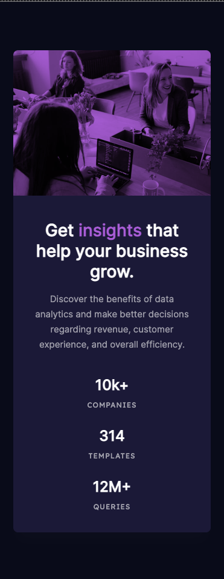

# Frontend Mentor - Stats preview card component solution

This is a solution to the [Stats preview card component challenge on Frontend Mentor](https://www.frontendmentor.io/challenges/stats-preview-card-component-8JqbgoU62).

## Table of contents

- [Frontend Mentor - Stats preview card component solution](#frontend-mentor---stats-preview-card-component-solution)
  - [Table of contents](#table-of-contents)
  - [Overview](#overview)
    - [The challenge](#the-challenge)
    - [Screenshot](#screenshot)
    - [Links](#links)
  - [My process](#my-process)
    - [Built with](#built-with)
    - [What I learned](#what-i-learned)
    - [Useful resources](#useful-resources)
  - [Author](#author)

## Overview

### The challenge

Users should be able to:

- View the optimal layout depending on their device's screen size

### Screenshot

### Links

- Live Site URL: [Github Pages Site](https://moodyjw.github.io/fe-mentor-stats-preview-card/)

## My process

### Built with

- HTML5
- SCSS
- Flexbox
- Mobile-first

### What I learned

Learned a lot about filtering images, `mix-blend-mode`, and that I still don't know wtf I'm doing most of the time

### Useful resources

- [MDN for CSS](https://developer.mozilla.org/en-US/docs/Web/CSS) - This always helps me!

## Author

- Frontend Mentor - [@MoodyJW](https://www.frontendmentor.io/profile/MoodyJW)
